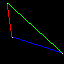
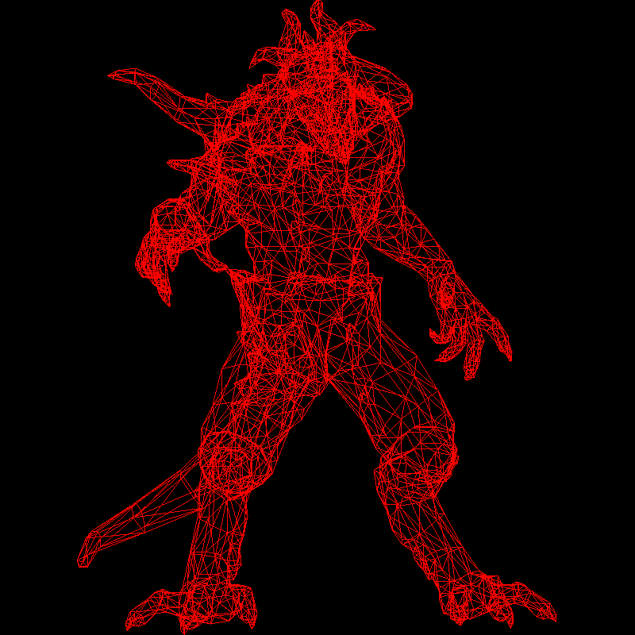
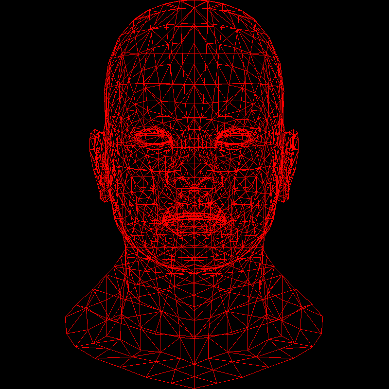
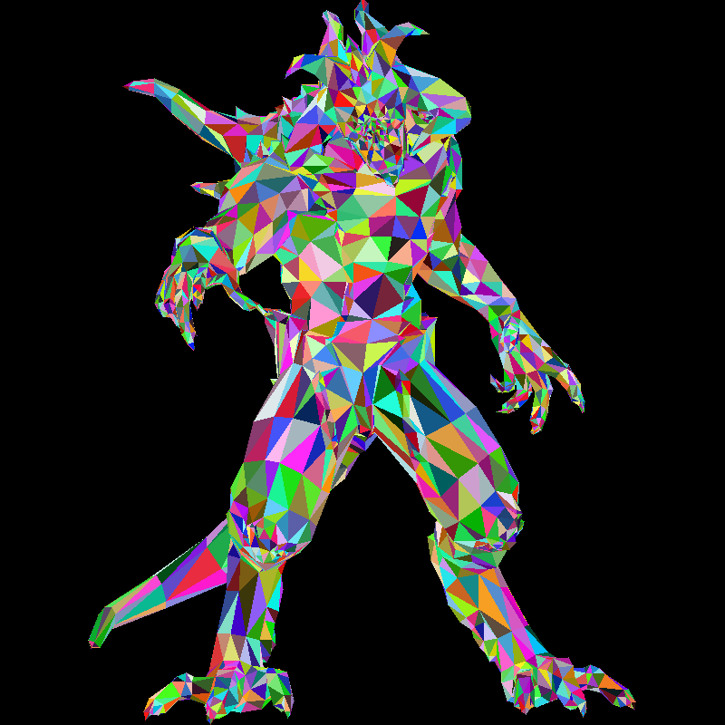
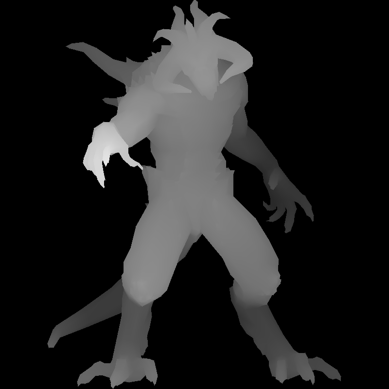
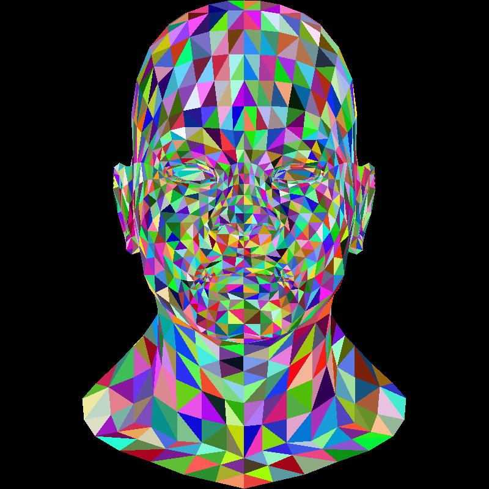
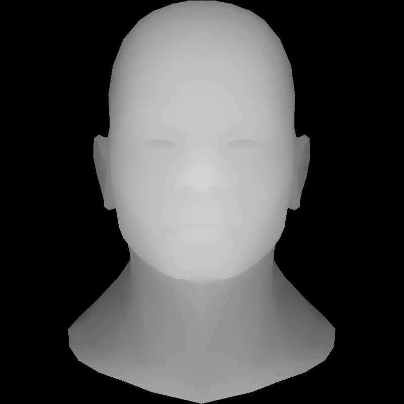

## tinyrender
A Software Rasterizer built from scratch in [Odin](https://odin-lang.org/), based on [SSLOY tinyrenderer course](https://haqr.eu/tinyrenderer/). No grahpics API, just rendering and creating PPM images.

### Triangles

### Wireframe

### Triangle Rasterization

